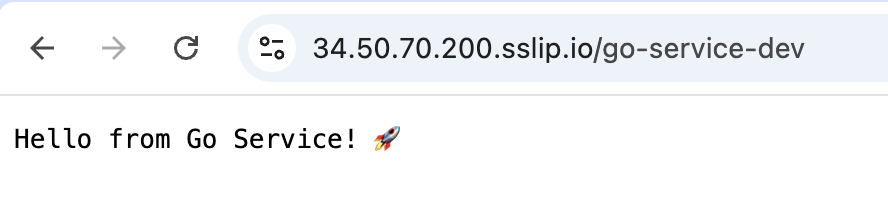

# SRE Take-Home Assignment - Monorepo CFX

Repository ini dibuat sebagai solusi untuk SRE Take-Home Assignment yang diberikan oleh interviewer. Project ini mendemonstrasikan implementasi CI/CD pipeline untuk monorepo yang berisi dua backend services (Go dan Node.js) yang di-deploy ke Kubernetes cluster.

## 📋 Assignment Overview

### Requirements
- Monorepo dengan dua backend services:
  - Service 1: Go (HTTP Server)
  - Service 2: Node.js (Express.js)
- Infrastructure: Kubernetes
- CI/CD Pipeline automation
- Public service exposure via DNS

### Yang Sudah Selesai
- Build container images for both services.
- Push container images to an image registry of your choice.
- Deploy to a Kubernetes cluster (you may provide just the Kubernetes
manifests instead of actual deployment).
- The services should be accessible via a DNS domain. (via sslip.io) 
- Design monitoring/logging for the deployed services.

### Yang Belum Selesai
- (Optional) Build and test the services.

## 🏗️ Project Structure

```
monorepo-cfx/
├── services/
│   ├── go-service/              # Go application
│   │   ├── main.go             # Simple HTTP server with IP logging
│   │   ├── go.mod              # Go module definition
│   │   ├── Dockerfile          # Multi-stage Docker build
│   │   └── k8s/                 # Kubernetes manifests
│   │       ├── base/           # Base deployment config
│   │       │   ├── deployment.yaml
│   │       │   ├── service.yaml
│   │       │   └── kustomization.yaml
│   │       └── overlays/       # Environment-specific configs
│   │           ├── development/
│   │           │   ├── ingress.yaml
│   │           │   └── kustomization.yaml
│   │           ├── staging/
│   │           │   ├── ingress.yaml
│   │           │   └── kustomization.yaml
│   │           └── production/
│   │               ├── ingress.yaml
│   │               └── kustomization.yaml
│   └── node-service/            # Node.js application
│       ├── index.js            # Express.js server with IP logging
│       ├── package.json        # Node.js dependencies
│       ├── Dockerfile          # Alpine-based container
│       └── k8s/                 # Kubernetes manifests
│           ├── base/           # Base deployment config
│           │   ├── deployment.yaml
│           │   ├── service.yaml
│           │   └── kustomization.yaml
│           └── overlays/       # Environment-specific configs
│               ├── development/
│               ├── staging/
│               └── production/
├── .github/
│   └── workflows/
│       └── ci.yml               # GitHub Actions CI/CD pipeline
├── monitoring/
│   └── grafana-alloy.yaml       # Grafana Alloy monitoring stack
└── README.md
```

## 🚀 Services Description

### Go Service
- **Framework**: Standard library `net/http`
- **Endpoint**:
  - `GET /` - Returns "Hello from Go Service! 🚀" with client IP logging
- **Port**: 8080
- **Features**:
  - Client IP extraction dari X-Forwarded-For header
  - Request logging dengan method, path, dan client IP
  - Simple HTTP response

### Node.js Service
- **Framework**: Express.js v4.18.2
- **Endpoint**:
  - `GET /` - Returns "Hello from Node Service! 🚀" with client IP logging
- **Port**: 8080
- **Features**:
  - Middleware untuk IP logging dari X-Forwarded-For header
  - Request logging dengan method, path, dan client IP
  - Simple HTTP response

## 🔄 CI/CD Pipeline Workflow

### GitHub Actions Pipeline (`.github/workflows/ci.yml`)

#### **Pipeline Triggers:**
- Push ke `development` branch → **Development deployment**
- Push ke `release/**` branches → **Staging deployment**
- Pull Request merged ke main dari `release/**` → **Production deployment**

#### **CI/CD Pipeline Flow:**


#### **Pipeline Stages (Current Implementation):**

**Development Pipeline:**
1. **Change Detection**: Menggunakan `dorny/paths-filter` untuk detect changed services
2. **Docker Build**: Build images hanya untuk services yang berubah
3. **Registry Push**: Push ke `ghcr.io` dengan tag `dev-{commit-sha}`
4. **Kustomize Deploy**: Update image tags dan apply ke development namespace

**Staging Pipeline:**
1. **Branch Parsing**: Extract service dan version dari `release/{service}/{version}`
2. **Docker Build**: Build specific service dengan version tag
3. **Registry Push**: Push ke `ghcr.io` dengan semantic version tag
4. **Kustomize Deploy**: Deploy ke staging environment

**Production Pipeline:**
1. **PR Validation**: Hanya deploy jika PR merged dari release branches
2. **Direct Deploy**: Deploy ke production namespace
3. **Git Tagging**: Create dan push release tags
4. **Version Management**: Semantic versioning untuk production releases

#### **Key Features:**
- **Incremental Builds**: Build hanya services yang berubah
- **Multi-Environment**: dev/staging/production namespaces
- **Semantic Versioning**: Production releases dengan proper tagging
- **Container Registry**: GitHub Container Registry (ghcr.io)

### Environment Setup
- **Development**: `monorepo-dev` namespace
- **Staging**: `monorepo-staging` namespace
- **Production**: `monorepo-production` namespace

## 🛠️ Technology Stack

### Application Development (Actual Implementation)
- **Go**: v1.25.3 (Standard library `net/http`)
- **Node.js**: v20-alpine (Express.js v4.18.2)
- **Containerization**:
  - Go: Multi-stage Docker build dengan golang:1.25.3 + alpine:3.19
  - Node.js: Single-stage dengan node:20-alpine

### CI/CD Pipeline (Actual Implementation)
- **CI/CD Platform**: GitHub Actions (self-hosted runners)
- **Container Registry**: GitHub Container Registry (ghcr.io)
- **Infrastructure as Code**: Kubernetes YAML + Kustomize
- **Change Detection**: dorny/paths-filter v3
- **Secret Management**:
  - GitHub Secrets (`GHCR_PAT`)
  - Kubernetes Secrets (`ghcr-secret`)

### Infrastructure (Actual Implementation)
- **Container Orchestration**: Kubernetes
- **Deployment Strategy**:
  - Go Service: 2 replicas
  - Node.js Service: 1 replica
- **Namespaces**: monorepo-dev, monorepo-staging, monorepo-production
- **Service Type**: ClusterIP dengan Ingress untuk external access

### Monitoring (Bonus - Actual Implementation)
- **Monitoring Stack**: Grafana Alloy (latest)
- **Log Collection**: Loki source file processing
- **Kubernetes Discovery**: Automatic pod discovery untuk monitoring namespaces
- **Log Processing**: log parsing dengan structured labels

## 🚀 How to Run/Test

### Prerequisites
```bash
# Install required tools
docker >= 20.x
kubectl >= 1.28
kustomize >= 4.x
gh (GitHub CLI) - untuk authentication
```

### Local Development (Actual Implementation)
```bash
# Clone repository
git clone https://github.com/ndrwj/monorepo-cfx.git
cd monorepo-cfx

# Run Go service
cd services/go-service
go run main.go
# Output: "Go service running on :8080"

# Run Node.js service (separate terminal)
cd services/node-service
npm install
npm start
# Output: "Node service running on :8080"

# Test both services
curl http://localhost:8080/  # Go service
curl http://localhost:8080/  # Node service (jika running di port berbeda)
```

### CI/CD Pipeline Setup (Actual Implementation)

#### 1. GitHub Setup
```bash
# Set GitHub secrets
gh secret set GHCR_PAT --body "your-github-token"
```

#### 2. Kubernetes Cluster Setup
```bash
# Create namespaces
kubectl create namespace monorepo-dev
kubectl create namespace monorepo-staging
kubectl create namespace monorepo-production
kubectl create namespace monitoring

# Create image pull secret untuk GHCR
kubectl create secret docker-registry ghcr-secret \
  --docker-server=ghcr.io \
  --docker-username=ndrwj \
  --docker-password=$GITHUB_TOKEN \
  --namespace=monorepo-dev
# Repeat untuk setiap namespace
```

#### 3. Monitoring Setup
```bash
# Deploy Grafana Alloy monitoring stack
kubectl apply -f monitoring/grafana-alloy.yaml
```

### Deployment via CI/CD (Actual Implementation)

#### Development Deployment
```bash
# Push ke development branch
git checkout development
git add .
git commit -m "feat: update service"
git push origin development

# CI/CD akan otomatis:
# 1. Build Docker images
# 2. Push ke ghcr.io dengan tag dev-{commit}
# 3. Deploy ke monorepo-dev namespace
```

#### Staging Deployment
```bash
# Create release branch
git checkout -b release/go-service/v1.0.0
git push origin release/go-service/v1.0.0

# CI/CD akan otomatis:
# 1. Parse service dan version
# 2. Build Docker image dengan tag v1.0.0
# 3. Deploy ke monorepo-staging namespace
```

#### Production Deployment
```bash
# Create PR dari staging ke main
gh pr create --base main --head release/go-service/v1.0.0 --title "Release go-service v1.0.0"

# Setelah PR merged, CI/CD akan:
# 1. Deploy ke monorepo-production namespace
# 2. Create git tag
# 3. Push tag ke repository
```

### Manual Kubernetes Deployment
```bash
# Deploy ke development
kubectl apply -k services/go-service/k8s/overlays/development/
kubectl apply -k services/node-service/k8s/overlays/development/

# Deploy ke staging
kubectl apply -k services/go-service/k8s/overlays/staging/
kubectl apply -k services/node-service/k8s/overlays/staging/

# Deploy ke production
kubectl apply -k services/go-service/k8s/overlays/production/
kubectl apply -k services/node-service/k8s/overlays/production/
```

### Testing Services

#### 🔗 **Public Access via sslip.io**
**🌐 Live Production URLs:**

| Service | Development | Staging | Production |
|---------|--------------|----------|-------------|
| **Go Service** | [https://34.50.70.200.sslip.io/go-service-dev](https://34.50.70.200.sslip.io/go-service-dev) | [https://34.50.70.200.sslip.io/go-service-staging](https://34.50.70.200.sslip.io/go-service-staging) | [https://34.50.70.200.sslip.io/go-service-prod](https://34.50.70.200.sslip.io/go-service-prod) |
| **Node Service** | [https://34.50.70.200.sslip.io/node-service](https://34.50.70.200.sslip.io/node-service) | [https://34.50.70.200.sslip.io/node-service-staging](https://34.50.70.200.sslip.io/node-service-staging) | [https://34.50.70.200.sslip.io/node-service-prod](https://34.50.70.200.sslip.io/node-service-prod) |

#### 🧪 **Quick Testing**
```bash
# Test public endpoints
curl https://34.50.70.200.sslip.io/go-service-dev
curl https://34.50.70.200.sslip.io/node-service-dev

# Expected responses:
# Go Service:  "Hello from Go Service! 🚀"
# Node Service: "Hello from Node Service! 🚀"
```

## 📊 Monitoring Setup (Bonus - Actual Implementation)

### Grafana Alloy Configuration
```bash
# Apply monitoring configuration
kubectl apply -f monitoring/grafana-alloy.yaml

# Check monitoring components
kubectl get pods -n monitoring
kubectl get daemonset -n monitoring

# Access Alloy UI
kubectl port-forward svc/grafana-alloy-svc 12345:12345 -n monitoring
```


## 🔧 Configuration

### Docker Images (Actual Implementation)
```bash
# Go Service
ghcr.io/ndrwj/monorepo-cfx/services/go-service:dev-{commit}
ghcr.io/ndrwj/monorepo-cfx/services/go-service:{version}

# Node.js Service
ghcr.io/ndrwj/monorepo-cfx/services/node-service:dev-{commit}
ghcr.io/ndrwj/monorepo-cfx/services/node-service:{version}
```

### Kubernetes Configuration (Actual Implementation)

#### Go Service Deployment
```yaml
replicas: 2
containers:
  - name: go-service
    command: ["./main"]
    args: ["http"]
    image: ghcr.io/ndrwj/monorepo-cfx/services/go-service
    ports:
      - containerPort: 8080
imagePullSecrets:
  - name: ghcr-secret
```

#### Node.js Service Deployment
```yaml
replicas: 1
containers:
  - name: node-service
    command: ["node"]
    args: ["index.js"]
    image: ghcr.io/ndrwj/monorepo-cfx/services/node-service
    ports:
      - containerPort: 8080
imagePullSecrets:
  - name: ghcr-secret
```

### Kustomize Structure
```yaml
# Base configuration untuk setiap service:
# - deployment.yaml (base deployment specs)
# - service.yaml (ClusterIP service)
# - kustomization.yaml (base kustomization)

# Environment-specific overlays:
# - ingress.yaml (external access configuration)
# - kustomization.yaml (environment-specific patches)
```

## 🌐 Public Access Configuration

### Nginx Reverse Proxy Configuration

**🔧 Nginx Setup untuk sslip.io Access:**

```nginx
# HTTP to HTTPS redirect
server {
    listen 80;
    server_name 34.50.70.200.sslip.io;
    location / {
        return 301 https://$host$request_uri;
    }
}

# HTTPS main server block
server {
    listen 443 ssl;
    server_name 34.50.70.200.sslip.io;

    # SSL configuration
    ssl_certificate /etc/nginx/ssl/certificate.crt;
    ssl_certificate_key /etc/nginx/ssl/private.key;

    # Development environment
    location /go-service-dev {
        proxy_pass https://[BACKEND_API_DOMAIN]/go-service-dev;
        proxy_set_header Host [BACKEND_API_DOMAIN];
        proxy_set_header X-Real-IP $remote_addr;
        proxy_set_header X-Forwarded-For $proxy_add_x_forwarded_for;
        proxy_set_header X-Forwarded-Proto https;
    }

    # Staging environment
    location /go-service-staging {
        proxy_pass https://[BACKEND_API_DOMAIN]/go-service-staging;
        proxy_set_header Host [BACKEND_API_DOMAIN];
        proxy_set_header X-Real-IP $remote_addr;
        proxy_set_header X-Forwarded-For $proxy_add_x_forwarded_for;
        proxy_set_header X-Forwarded-Proto https;
    }

    # Production environment
    location /go-service-prod {
        proxy_pass https://[BACKEND_API_DOMAIN]/go-service-prod;
        proxy_set_header Host [BACKEND_API_DOMAIN];
        proxy_set_header X-Real-IP $remote_addr;
        proxy_set_header X-Forwarded-For $proxy_add_x_forwarded_for;
        proxy_set_header X-Forwarded-Proto https;
    }

    # Node.js services
    location /node-service {
        proxy_pass https://[BACKEND_API_DOMAIN]/node-service;
        proxy_set_header Host [BACKEND_API_DOMAIN];
        proxy_set_header X-Real-IP $remote_addr;
        proxy_set_header X-Forwarded-For $proxy_add_x_forwarded_for;
        proxy_set_header X-Forwarded-Proto https;
    }

    location /node-service-staging {
        proxy_pass https://[BACKEND_API_DOMAIN]/node-service-staging;
        proxy_set_header Host [BACKEND_API_DOMAIN];
        proxy_set_header X-Real-IP $remote_addr;
        proxy_set_header X-Forwarded-For $proxy_add_x_forwarded_for;
        proxy_set_header X-Forwarded-Proto https;
    }

    location /node-service-prod {
        proxy_pass https://[BACKEND_API_DOMAIN]/node-service-prod;
        proxy_set_header Host [BACKEND_API_DOMAIN];
        proxy_set_header X-Real-IP $remote_addr;
        proxy_set_header X-Forwarded-For $proxy_add_x_forwarded_for;
        proxy_set_header X-Forwarded-Proto https;
    }
}
```

## 📸 Visual Documentation

### Kubernetes Services Status


*Services running across dev, staging, and production namespaces*

### Public Access Testing


*Testing live endpoints via sslip.io*

### Monitoring Dashboard

